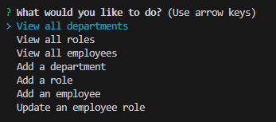
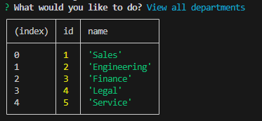
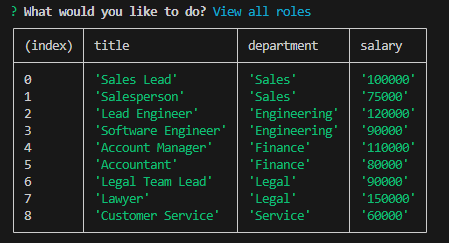
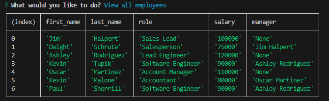
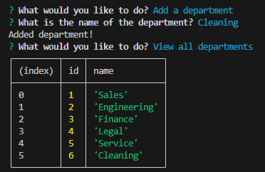
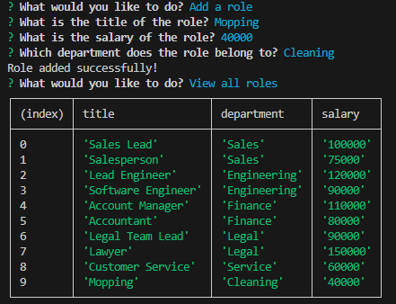
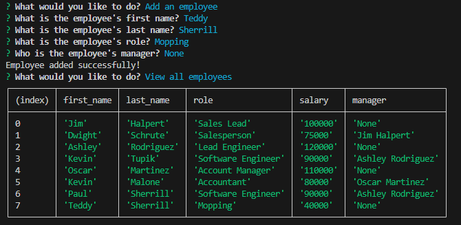
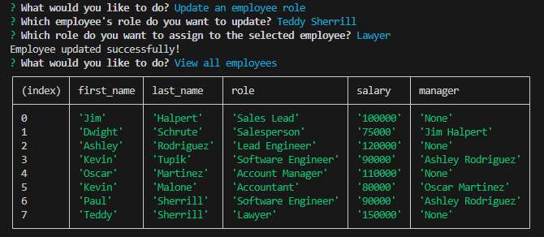

# Employee Tracker

## Description

In this challenge, I was tasked with creating a Node.js command line application that manages a company's database containing the departments, roles, and employees within the company. I was tasked with making the application responsive to user input so that when the user wants to view the company's departments, roles, and employees, they are presented with tables containing more details about each. I was also tasked with allowing the user to add more departments, roles, and employees to the company's database as well as update an employee's role within the database.

## Installation

To install my code, I started by installing my modules (express, inquirer, and pg). I then began by creating my database in a schema.sql file and creating the tables for the departments, roles, and employees. It was important to make sure each table had the correct columns and foreign keys so that the correct information would be available to the user. The next step form there was to create my seeds to test that the SQL was running correctly and also selecting the correct columns for each table so that the information was applicable to the user. I tested this by running postgreSQL and installing the schema and seeds file. 

From there, it was time to start the actual command line application. The first step in doing so was by syncing the database to the server by using new Pool command. I then started creating the main prompt that asks what the user wanted to do by using inquirer.prompt. Next, I created if statements to match with each answer choice so that the application would run something different depending on the user's answer choice. The first three answer choices were pretty simple because all I had to do was copy the selections I had used in my seeds.sql file and, using a pool.query, match each with the specific table the user wanted to view. For adding a department, I used inquirer.prompt to get user input for a new department name. I then used a pool.query to insert that into the departments table. For adding a role, I did the same, however one of the prompts had to have choices from the departments, so I used a pool.query to select the departments table and put the departments into a variable to use for the list of choices. For adding an employee, I did the same thing as adding a role, however, I had to pull data from two tables for answer choices, so I used a Promise to create two variables, one for each list of answer choices. For updating an employee, I did the same exact thing but instead of just inserting into the employees table, I used the pool.query to update a specific employee based on the id of the employee chosen by the user. 

After all that, I noticed the tables were being displayed as arrays, so I changed console.log to console.table to display them. 

## Usage

CLick on the link to see a video to see a walk through video of the application https://app.screencastify.com/v3/watch/p4cFsGlSQnrJvcvhVxYr

Once you arrive to the application on the terminal, you will see a prompt asking what you would like to do in the company database. 

Upon clicking 'View all departments', a table with all the departments within the company will display. Immediately after, you will again be asked what you like to do in the database.

Upon clicking 'View all roles', a table with all the different roles as well as the department they fall under and the salary for each role within the company will display. 

Upon clicking 'View all employees', a table with all the different employees with their first and last name, role, salary, and manager will display. 

Upon clicking 'Add a department', you will be prompted with a question asking what you would like to name the department. Once answered, you will see a message saying 'Department added successfully' and you can select 'View all departments' to check. 

Upon clicking 'Add a role', you will be prompted with a question asking what you would like to title the role. Once answered, you will see another question asking what the salary for this role will be. Once answered you see another question asking which department the role belongs to and there will be a list of choices to choose from. Once one is selected, a message saying 'Role added succesfully!' will display and you can select 'View all roles' to check. 

Upon clicking 'Add an employee', you will be prompted with questions asking what the first and last name of the employee is. Once answered, you will see another question asking what the employee's role is and a list of the roles will be avilable to choose from. Once answered you see another question asking who the employee's manager is and a liust of all the employees wil be available to choose from. Once one is selected, a message saying 'Employee added succesfully!' will display and you can select 'View all employees' to check. 

Upon clicking 'Update an employee role', you will be prompted with a question asking which employee's role you would like to update and a list of all the employees will be available to choose from. Once answered, you will see another question asking what role you would like to assign to the employee and a list of all the roles will be available to choose from. Once one is selected, a message saying 'Employee updated succesfully!' will display and you can select 'View all employees' to check. 

